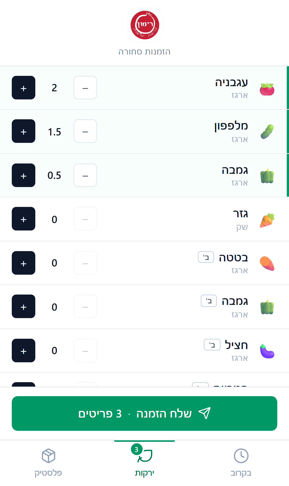
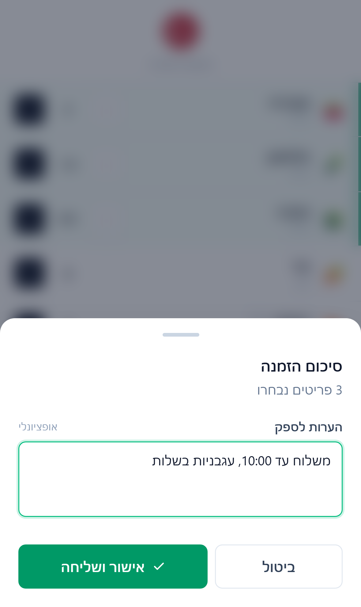

<div align="center">
  

  # Rimon — Orders Management

  A mobile-first web app for managing supplier orders, built for **Rimon Healthy Israeli** restaurant.
</div>

---

## Overview

A Hebrew, RTL, mobile-first web application that lets restaurant staff build a vegetable order in seconds and send it directly to the supplier's WhatsApp. All items, units, and quantities live in a single organized list, with support for half-unit quantities and grade-B item tagging.

## Screenshots

| Item list | Send summary |
|:---:|:---:|
|  |  |

> To make the screenshots appear here — create a `docs/` folder at the project root and add `screenshot-list.png` and `screenshot-modal.png`.

## Features

- **Fast item selection** — continuous list with + / − buttons and a free-form quantity input
- **Half-unit quantities** — 0.5 increments, with automatic snap-to-half when typing manually
- **Grade-B tagging** — `isGradeB` flag in data, UI badge, and automatic `ב'` suffix in the outgoing message
- **Supplier-facing name** — optional `fullName` field overrides the display name in the message (e.g., `סלרי מהדרין`)
- **Free-form notes** — notes field in the confirmation modal
- **One-tap WhatsApp send** — single click, with a structured format: date, item list, notes
- **Full RTL** + Lucide-style SVG icons
- **Mobile-first** — bottom tab bar, bottom-sheet modal, proper touch targets

## Requirements

- Node.js `20.19+` or `22.12+`
- npm

## Setup

### 1. Install dependencies

```bash
npm install
```

### 2. Configure environment

Create a `.env.local` file at the project root (copy from the template):

```bash
cp .env.example .env.local
```

Edit `.env.local` and set the supplier's WhatsApp number in international format:

```
VITE_SUPPLIER_VEGETABLES=972501234567
```

> **Security note:** `VITE_*` variables are inlined into the bundle at build time, meaning they are visible in the production JS. This setup hides the number **from Git** only. For real secrecy, route the WhatsApp send through a server-side proxy.

### 3. Scripts

```bash
npm run dev          # dev server with HMR
npm run build        # type-check + production build
npm run preview      # preview the production build locally
npm run type-check   # type checking only
```

## Tech Stack

- **Vue 3** — Composition API with `<script setup>`
- **TypeScript**
- **Vite** — dev server and build tool
- **Tailwind CSS v4** — via `@tailwindcss/vite`

## Project Structure

```
rimon-orders/
├── src/
│   ├── App.vue              # Root component - all UI & logic
│   ├── main.ts              # Entry point
│   ├── config.ts            # Restaurant name, supplier numbers (from env)
│   ├── data/
│   │   └── vegetables.ts    # Item catalog & metadata
│   └── assets/
│       ├── rimon-logo.png   # App logo
│       └── main.css         # Tailwind import
├── .env.example             # Env template (committed)
├── .env.local               # Real values (gitignored)
└── vite.config.ts
```

## Editing the Item List

All items are defined in [`src/data/vegetables.ts`](src/data/vegetables.ts). The order in the file is the order shown in the UI.

```ts
{
  id: 'tomato',              // unique identifier
  name: 'עגבניה',            // display name (UI)
  unit: 'ארגז',              // unit: 'ק"ג' | 'ארגז' | 'שק' | 'יחידה'
  icon: '🍅',                // display emoji
  fullName: 'עגבניה תמר',    // optional - supplier-facing name in the message
  isGradeB: true,            // optional - grade B (UI badge + ב' suffix in message)
}
```

## Outgoing Message Format

The WhatsApp message sent to the supplier looks like this:

```
הזמנה - רימון בריאות ישראלית 18/05:

עגבניה - 2 ארגז
מלפפון - 1.5 ארגז
גמבה ב' - 0.5 ארגז

הערות: משלוח עד 10:00
```

## License

Internal use — Rimon Healthy Israeli.
